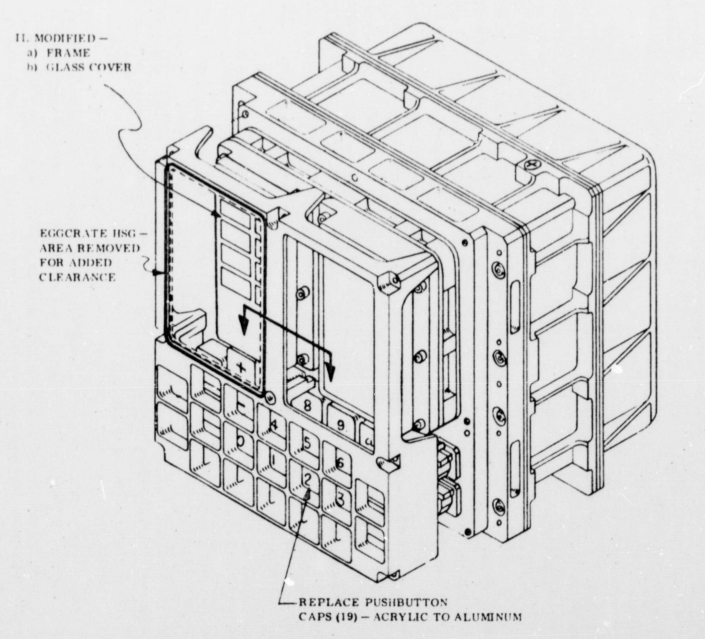

# AGC Mechanical CAD Models and Drawings

This repository contains downloadable Autodesk Fusion 360 and STEP CAD models of many Apollo Guidance Computer components.

## Introduction

The Apollo Guidance Compuer (AGC) is one of the critical inventions that made the U.S. moon landings possible. AGC's were installed in both the Apollo Command Module and Lunar Excursion Module. MIT and NASA archives, as well as important contributions from some
of the original team members have given us a rich set of detail about how this computer was constructed.

The [Virtual AGC Project](https://www.ibiblio.org/apollo/) was originally focused on software simulation 
of the AGC. 

Over time, the Virtual AGC Project branched in many directions. Simulation projects for other space related guidance systems
were researched; hybrid hardware and software models of the AGC have been created. The circuitry of the AGC has been reproduced using modern IC components. 

More recently, Ron Burkey, the Virtual AGC project's leader, scanned, cataloged, and published
the [original MIT electrical and mechanical drawings of the AGC](https://www.ibiblio.org/apollo/ElectroMechanical.html). This detailed catalog has made it possible to construct CAD models of the AGC's mechanical components.

The content in this repository represents my work using Fusion 360 to generate CAD models from those original drawings using modern CAD/CAM tooling.

### Archived Drawings Collections are Incomplete

It is worth saying that the archives that I have found so far on this project are incomplete.
The AGC evolved substantially over its lifetime  -- descriptions of many changes
are captured in Engineering Change Proposals (ECPs) which may or may not be completely
reflected in the archived drawings. Also, there are gaps in the drawing collections.  
This requires reconstruction
of some parts in order to develop a more complete model.

## How These Models Were Created

[Autodesk's Fusion 360](https://www.autodesk.com/products/fusion-360/students-teachers-educators) was used exclusively to create these models. 
While Fusion 360 is not open source software, Autodesk offers a no-cost
license to students, makers, and startups. You can obtain your own copy of Fusion 360 and begin editing the .f3d files contained in this project. 
STEP-format CAD models for each component have been exported and included in this project as well. 
Those model files are directly usable by many other CAD modeling and 3D-printing systems.

Panel markings use an engraving font face called "Gorton". Eugene Dorr created OTF and TTF versions of these fonts. These files can be downloaded from https://github.com/ehdorrii/dsky-fonts 

## Is This a Complete AGC Model?

No. I am releasing what I have transcribed so far. That amounts to roughly twenty models. Each is currently 90-100% completely encoded from the original engineering documents.

I'm working to maintain engineering precision wherever I can. Errors undoubtedly exist, and I'm my own Quality
Assurance department currently. In other words, use at your own risk.

## The DSKY: Pushbutton Springs and "Fire Fixes"

[This Raytheon contractor report](https://ntrs.nasa.gov/citations/19700015154) describes important
upgrades to the DSKY that are not completely captured in the archived drawing collections:

>h. DSKY pushbutton switch spring - Due to failures of the DSKY
pushbutton switch spring (shown in Figure 3-6) a failure analysis and
design review of the spring was performed. The failure inalysis and
design review indicated that in normal use the spring could crack at
points of stress concentration. As a result, a new spring was designed.
As shown in the drawing, the new spring replaces the present
spring in form, fit, and function with tighter geometric constraints.

>The wraparound design of the new spring lengthens the spring arm
to reduce stress and allows the new spring to be incorporated in the existing
pushbutton switch design. The thickness of the spring has changed from
0.010 to 0.018 inch to retain the same spring rate. The material of the
new spring is the same as that for the present spring but is specially
hardened to a minimum of 270,000 lbf/in^2 U.T.S. to increase the fatigue
strength of the spring.
>
>i. DSKY fire fix - As a result of the
 flammability study performed as authorized by CCA 497-0428, the DSKY alarm indicator(P/N 1006387-003) and DSKY pushbutton caps (P/N 1006353) requiredmaterial changes as follows (see Figure 3-7)
>
>>1. alarm indicator - affix nonflammable nonreflective glass
cover with an aluminum frame as an integral part of the indicator panel
>>2. DSKY pushbutton caps - rep:ace the acrylic cap with one of aluminum having etched and acrylic filled characters.

>j. Teflon - (not included here, as it dosen't directly apply to the Fusion CAD models, but Teflon coatings were added to reduce the tendency for pushbuttons operate less smoothly due to wear.)

These changes are listed here but not yet integrated into this CAD project.

## My Background

My name is Riley Rainey. I'm a software developer by profession. I spent a number of years building aerospace simulations as my day job.
I'm not a Professional Engineer by any stretch, but my work in simulation put me in close contact with CAD designers and CAD systems. I used AutoCad many years ago, but my exposure to Fusion 360 began with this project.

## Getting Support

There's no official support available, but if you notice a problem or have a request for a specific drawing to be
transcribed, [create an issue](https://github.com/rrainey/agc-mechanical-cad/issues) in this GitHub project.

  
This work is licensed under a [Creative Commons Attribution-ShareAlike 4.0 International License](http://creativecommons.org/licenses/by-sa/4.0/).
